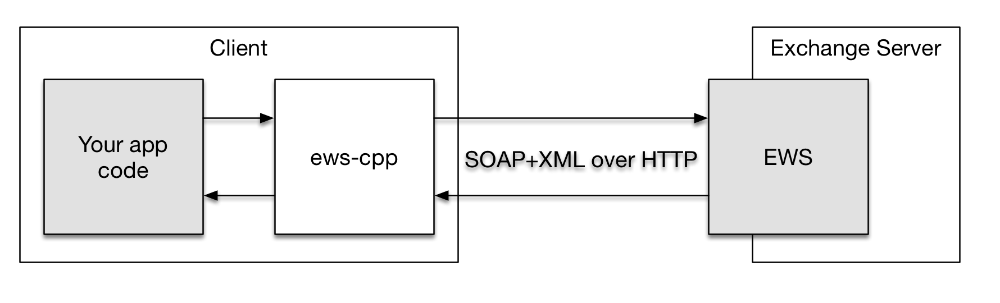
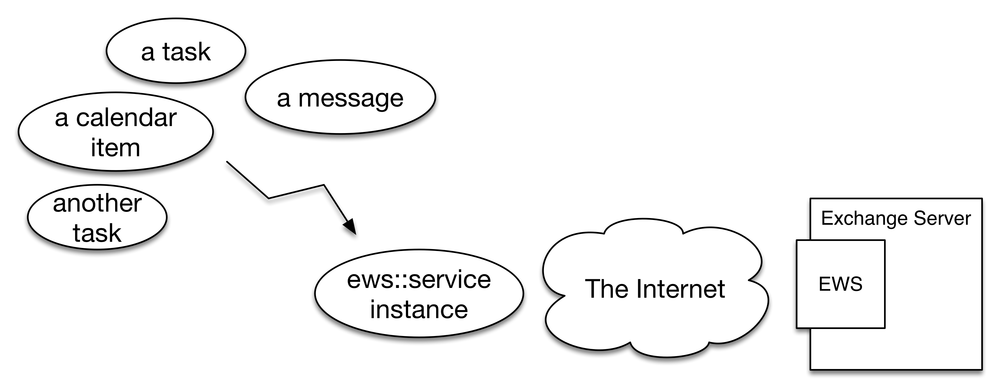

# Overview

EWS is an API that third-party programmers can use to communicate with
Microsoft Exchange Server. The API exists since Exchange Server 2007 and is
continuously up-dated by Microsoft and present in the latest iteration of the
product, Exchange Server 2016.

This library provides a native and platform-independent way to use EWS in your
C++ application.





## Supported Operations and Elements

* Autodiscover
* `<CreateItem/>`, `<SendItem/>`, `<FindItem/>`, `<GetItem/>`, `<UpdateItem/>`,
  and `<DeleteItem/>` operations
* `<CreateAttachment/>`, `<GetAttachment/>`, `<DeleteAttachment/>` for file
  attachments. Item attachments are not supported yet
* `<CalendarItem/>`, `<Message/>`, `<Contact/>`, `<Task/>` items. Note that we
  still don't support all properties of these items. But we're working on it

## Supported Authentication Schemes

* HTTP basic auth
* NTLM
* Kerberos is currently not supported but its on the TODO list

## Supported Compilers

* Visual Studio 2012
* Visual Studio 2013
* Visual Studio 2015
* Clang since 3.5
    - with libc++ on Mac OS X
    - with libstdc++ on Linux (Note that libc++ on Linux is not supported)
* GCC since 4.8 with libstdc++

|Compiler|64-bit|32-bit|
|--------|:----:|:----:|
|Visual Studio 2012| * | * |
|Visual Studio 2013|[](https://ci.appveyor.com/project/raldus/ews-cpp-ea5m3/branch/master)|[](https://ci.appveyor.com/project/raldus/ews-cpp-yxo80/branch/master)|
|Visual Studio 2015|[](https://ci.appveyor.com/project/raldus/ews-cpp-do8dr/branch/master)|[](https://ci.appveyor.com/project/raldus/ews-cpp-pa626/branch/master)|
|Clang 3.5 with libc++| * | * |
|GCC 4.8 with libstdc++|[](https://travis-ci.org/otris/ews-cpp)| * |
\* = will be added soon


## Supported Operating Systems

* Microsoft Windows 8.1 and Windows 10
* macOS starting with 10.12
* RHEL 7
* Ubuntu starting with 16.04 LTS
* SLES 12.1


## Supported Microsoft Exchange Server Versions

* Microsoft Exchange Server 2013 SP1

However, our goal is to support all Exchange Server versions since 2007.


## Run-time Dependencies

* libcurl, at least version 7.22


## Dev Dependencies

* Git
* CMake
* Doxygen (optional)
* Boost (optional)
* Python 2 or 3 (optional)


## Note Windows Users

You can obtain an up-to-date and easy-to-use binary distribution of libcurl
from here: [confusedbycode.com/curl](http://www.confusedbycode.com/curl/)

Additionally, you probably need to tell CMake where to find it. Just set
`CMAKE_PREFIX_PATH` to the path where you installed libcurl (e.g.
``C:\Program Files\cURL``) and re-configure.

You can also use the Windows batch script provided in
``scripts\build-curl.bat`` to download and compile libcurl for your particular
version of Visual Studio.


## Source Code

ews-cpp's source code is available as a Git repository. To obtain it, type:

```bash
git clone --recursive https://github.com/otris/ews-cpp.git
```


## Building

### Linux

The library is header-only. So there is no need to build anything. Just copy the
`include/ews/` directory wherever you may like.

To build the accompanied tests with debugging symbols and Address Sanitizer
enabled do something like this:

```bash
cmake -DCMAKE_BUILD_TYPE=Debug -DENABLE_ASAN=ON /path/to/source
make
```

Type `make edit_cache` to see all configuration options. `make help` shows you
all available targets.

### Windows

To build the tests and examples on Windows you can use `cmake-gui`.  For more
see: https://cmake.org/runningcmake/

If you do not want to use any GUI to compile the examples and tests you could
do something like this with the Windows `cmd.exe` command prompt:

```bat
set PATH=%PATH%;C:\Program Files (x86)\CMake\bin
mkdir builddir
cd builddir
cmake -G "Visual Studio 14 2015 Win64" ^
    -DCURL_LIBRARY="C:\Program Files\cURL\7.49.1\win64-debug\lib\libcurl_debug.lib" ^
    -DCURL_INCLUDE_DIR="C:\Program Files\cURL\7.49.1\win64-debug\include" ^
    C:\path\to\source
cmake --build .
```

Make sure to choose the right generator for your environment.


### API Docs

Use the `doc` target to create the API documentation with Doxygen.  Type:

```bash
make doc
open html/index.html
```


### Test Suite

In order to run individual examples or the test suite export following
environment variables like this:

```bash
export EWS_TEST_DOMAIN="DUCKBURG"
export EWS_TEST_USERNAME="mickey"
export EWS_TEST_PASSWORD="pluto"
export EWS_TEST_URI"https://hire-a-detective.com/ews/Exchange.asmx"
```

Be sure to change the values to an actual account on some Exchange server that
you can use for testing. Do not run the tests on your own production account.

Once you've build the project, you can execute the tests with:

```bash
./tests --assets=/path/to/source/tests/assets
```


## Design Notes

ews-cpp is written in a "modern C++" way:

* C++ Standard Library, augmented with rapidxml for XML parsing
* Smart pointers instead of raw pointers
* Pervasive RAII idiom
* Handle errors using C++ exceptions
* Coding conventions inspired by Boost


## API

Just add:

```c++
#include <ews/ews.hpp>
```

to your include directives and you are good to go.

Take a look at the `examples/` directory to get an idea of how the API feels.
ews-cpp is a thin wrapper around Microsoft's EWS API. You will need to refer to
the [EWS reference for
Exchange](https://msdn.microsoft.com/en-us/library/office/bb204119%28v=exchg.150%29.aspx)
for all available parameters to pass and all available attributes on items.
From 10.000ft it looks like this:





You have items and you have **the** service. You use the service whenever you
want to talk to the Exchange server.

Please note one important caveat though. ews-cpp's API is designed to be
"blocking". This means whenever you call one of the service's member functions
to talk to an Exchange server that call blocks until it receives a request from
the server. And that may, well, just take forever (actually until a timeout is
reached). You need to keep this in mind in order to not block your main or UI
thread.

Implications of this design choice

Pros:

* A blocking API is much easier to use and understand

Cons:

* You just might accidentally block your UI thread
* You cannot issue thousands of EWS requests asynchronously simply because you
  cannot spawn thousands of threads in your process. You may need additional
  effort here

## Legal Notice
ews-cpp is developed by otris software AG and was initially released to the
public in July 2016. It is licensed under the Apache License, Version 2.0 (see
[LICENSE file](LICENSE)).

For more information about otris software AG visit our website
[otris.de](https://www.otris.de/) or our Open Source repositories at
[github.com/otris](https://github.com/otris).


<!-- vim: et sw=4 ts=4:
-->
